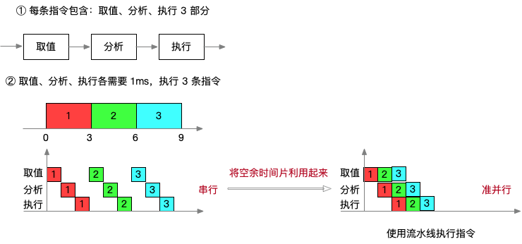

# 计算机结构

## 1. CPU 的组成（运算器与控制器）

1. 运算器（跟数据、运算、算术相关的）
   1. 算术逻辑单元 ALU：数据的算术运算和逻辑运算
   2. 累加寄存器：通用寄存器，为 ALU 提供一个工作区，用在暂存数据
   3. 数据缓冲寄存器 DR：写内存时，暂存指令或数据
   4. 状态条件寄存器 PSW：存状态标志与控制标志
2. 控制器（跟程序、指令、地址相关的）
   1. 程序计数器 PC：存储下一条要执行指令的**地址**（一条指令执行完毕，地址 + 1）
   2. 指令寄存器 IR：存储即将执行的**指令**
   3. 指令译码器 ID：对指令中的操作码字段进行分析解释
   4. 时序部件：提供时序控制信号

> 考点：
>
> 1. 判断以下部件属于运算器还是控制器
> 2. 判断各个部件的功能

### CPU 的组成例题

**题目 1**：在 CPU 中，用（ A ）给出将要执行的下一条指令在内存中的地址。

1. A. 程序计数器
2. B. 指令寄存器
3. C. 主存地址寄存器
4. D. 状态条件寄存器

**题目 2**：计算机中提供指令地址的程序计数器 PC 在（ A ）中。

1. A. 控制器
2. B. 运算器
3. C. 存储器
4. D. I/O 设备

## 2. 寻址方式

### 2.1 指令的基本概念

指令是机器语言的语句，是一组有意义的二进制代码，指令的基本格式如下：`操作码字段 + 地址码字段`。

### 2.2 寻址方式

1. **立即寻址方式**：操作数直接在指令中，**速度快，灵活性差**；
2. **直接寻址方式**：指令中存放的是操作数的**地址**；
3. **间接寻址方式**：指令中存放了一个地址，这个地址对应的内容是**操作数的地址**；
4. **寄存器寻址方式**：寄存器存放操作数；
5. **寄存器间接寻址方式**：寄存器内存放的是操作数的地址。

#### 寻址方式例题

**题目 1**：在机器指令的地址字段中，直接指出操作数本身的寻址方式称为（ C ）。

1. A. 隐含寻址
2. B. 寄存器寻址
3. C. 立即寻址
4. D. 直接寻址

**题目 2**：计算机指令系统采用多种寻址方式。立即寻址是指操作数包含在指令中，寄存器寻址是指操作数在寄存器中，直接寻址是指操作数的地址在指令中。这三种寻址方式操作数的速度（ A ）。

1. A. 立即寻址最快，寄存器寻址次之，直接寻址最慢
2. B. 寄存器寻址最快，立即寻址次之，直接寻址最慢
3. C. 直接寻址最快，寄存器寻址次之，立即寻址最慢
4. D. 寄存器寻址最快，直接寻址次之，立即寻址最慢

### 2.3 CISC & RISC

| 指令系统类型  | 指令                                                                                     | 寻址方式   | 实现方式                                             | 其他                       |
| ------------- | ---------------------------------------------------------------------------------------- | ---------- | ---------------------------------------------------- | -------------------------- |
| CISC （复杂） | 数量多，使用频率差别大，可变长格式                                                       | 支持多种式 | 微程序控制技术（微码）                               | 研制周期长                 |
| RISC (精简)   | 数量少，使用频率接近，定长格式，大部分为单周期指令，操作寄存器，只有 Load/Store 操作内存 | 支持方式少 | 增加了通用寄存器；硬布线逻辑控制为主；适合采用流水线 | 优化编译，有效支持高级语言 |

> 考点：CISC & RISC 的区别 C：complex 复杂 / R：reduced 精简。

#### CISC & RISC 例题

**题目 1**：以下关于RISC （精简指令系统计算机）技术的叙述中，错误的是（ B ）。

1. A. 指令长度固定、指令种类尽量少
2. B. 指令功能强大、寻址方式复杂多样
3. C. 增加寄存器数目以减少访存次数
4. D. 用硬布线电路实现指令解码，快速完成指令译码

### 2.4 流水线技术

#### 流水线概念

- 流水线是指在程序执行时**多条指令重叠进行操作**的一种**准并行**处理实现技术。各种部件同时处理是针对不同指令而言的，它们可**同时为多条指令的不同部分进行工作**，以**提高各部件的利用率**和**指令的平均执行速度**；
- 相关参数计算：**流水线执行时间计算**、**流水线吞吐率**、**流水线加速比**、**流水线效率**。



> 提示：流水线技术适合用于精简指令集系统（RISC）。

#### 流水线执行时间计算

流水线执行时间计算公式为：

```txt
理论公式：

1 条指令执行时间＋(指令条数 - 1）* 流水线周期

实践公式：

k * t + (n - 1) * t

- t 是流水线周期
- k 是执行步骤
- n 是指令条数

提示：每一步骤都按照指令周期执行，好估算，不用累加每一步骤的执行时间。
```

- **流水线周期**为执行时间最长的一段，上图示例中，流水线周期为 1ms；
- 示例：如果一条指令要做 3 个操作，分别是：1ms，2ms，3ms，则**流水线周期 = 3ms**。

**题目**：一条指令的执行过程可以分解为取指、分析和执行三步，其中：

- t取指=3Δt
- t分折=2Δt
- t执行=4Δt

若按串行方式执行，则 10 条指令全部执行完需要（ 90 ）Δt；
若按流水线的方式执行，流水线周期为（ 4 ）Δt，则 10 条指令全部执行完需要 （ 45 ）Δt。

```txt
一条指令执行时间 = 3 + 2 + 4 = 9Δt
流水线周期 = 4Δt

10 条指令串行执行时间 = 10 * 9 = 90Δt
10 条指令流水线执行时间 = 9 + (10 - 1) * 4 = 45Δt
```

#### 流水线吞吐量计算

流水线的吞吐率 (Though Putrate - TP）是指在单位时间内流水线所**完成的任务数量**或输出的结果数量。计算流水线吞吐率的最基本的公式如下：

> 吞吐量类似于**速度**，即单位时间能够完成的指令数量。

```txt
TP = 指令条数 / 流水线执行时间

最大吞吐率：

TP(max) = lim(n → ∞) (n / (k - 1 + n) * t) = 1 / t

- t 是流水线周期

提示：n 趋近于 ∞，k - 1 可以忽略不计。
```

**题目 1**：一条指令的执行过程可以分解为取指、分析和执行三步，其中：

- t取指=3Δt
- t分折=2Δt
- t执行=4Δt

10条指令的吞吐率为（ 2/9 ），最大吞吐率为（ 1/4 ）。

```txt
一条指令执行时间 = 3 + 2 + 4 = 9Δt
流水线周期 = 4Δt

流水线执行时间 = 9 + (10 - 1) * 4 = 45

吞吐率 TP = 10 / 45 = 2 / 9
最大吞吐率 = 1 / 4
```

**题目 2**：下列关于流水线方式执行指令的叙述中，不正确的是（ A ）。

1. A. 流水线方式可提高单条指令的执行速度
2. B. 流水线方式下可同时执行多条指令
3. C. 流水线方式提高了各部件的利用率
4. D. 流水线方式提高了系统的吞吐率

**题目 3**：将一条指令的执行过程分解为取指、分析和执行三步，按照流水线方式执行，若：t取指=4Δt、t分析=2Δt、t执行=3Δt，则执行完 100 条指令，需要的时间为（ D ）Δt。

1. A. 200
2. B. 300
3. C. 400
4. D. 405

```txt
一条指令执行时间 = 3 + 2 + 4 = 9Δt
流水线周期 = max(2, 3, 4) = 4Δt

流水线执行时间 = 9 + 99 * 4 = 9 + 396 = 405
```
